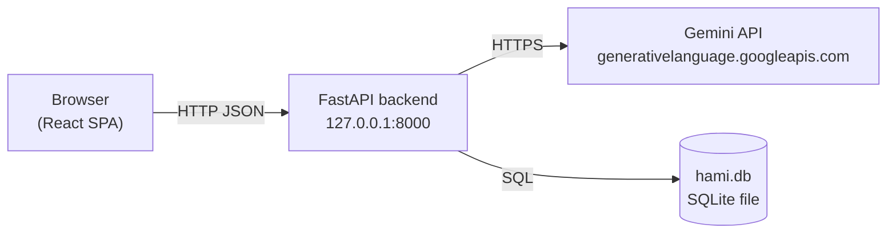
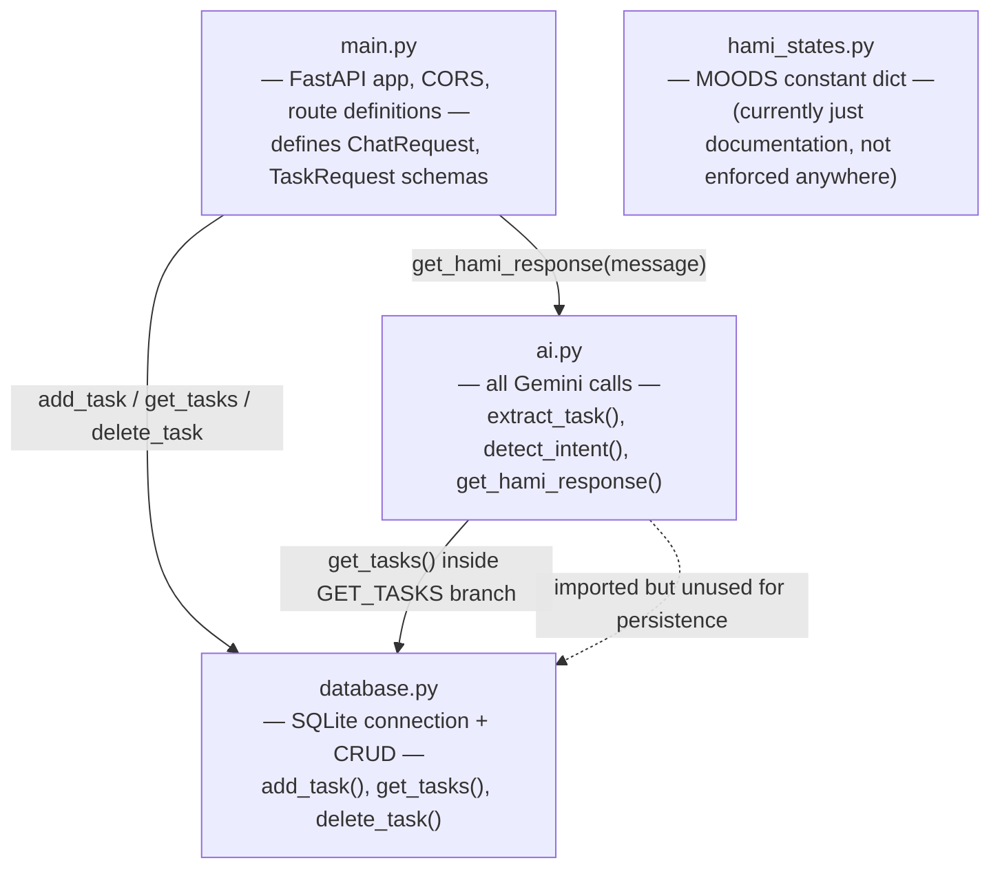
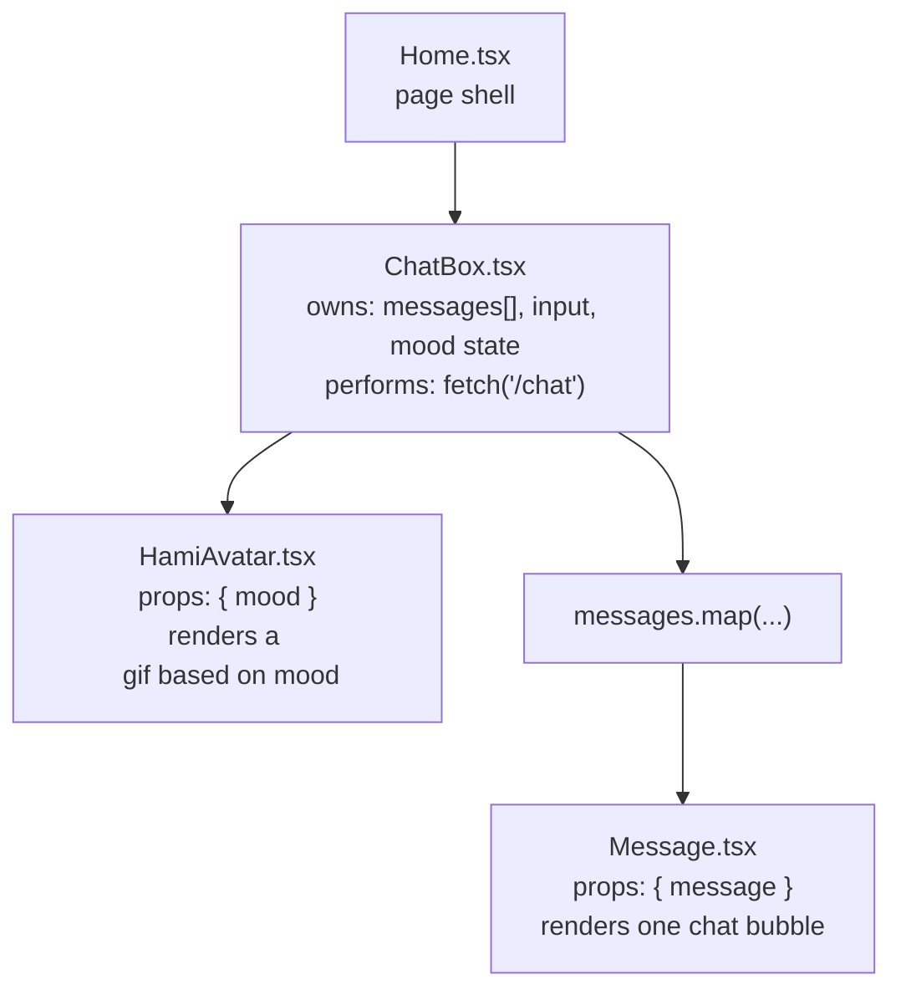

# Architecture

This document goes one level deeper than the main [README](../README.md) into how Hami AI's pieces fit together.

## 1. System Overview

Hami AI is a two-tier app: a React SPA talking over plain REST/JSON to a FastAPI backend, which in turn calls Google's Gemini API for all "intelligence" and a local SQLite file for task persistence. There is no auth layer, no queueing, no caching — everything is synchronous, request/response.

## 2. Backend Module Responsibilities

**`main.py`** is intentionally thin — it owns the HTTP surface (3 routes) and request/response schemas (`ChatRequest`, `TaskRequest`), and delegates everything else.

**`ai.py`** owns all interaction with Gemini. It makes up to **two separate HTTP calls per chat turn**:
1. `detect_intent()` — always called first, using `gemini-2.5-flash-lite`, to classify the message.
2. Depending on the result: `extract_task()` (also `flash-lite`) for `ADD_TASK`, or a persona-flavored call to `gemini-2.5-flash` for `NORMAL_CHAT`. `GET_TASKS` and `DELETE_TASK` don't call Gemini a second time.

**`database.py`** opens a single module-level SQLite connection (`check_same_thread=False`) and exposes three plain functions. There's no connection pooling, migrations system, or ORM.

**`hami_states.py`** is just a dictionary of mood name → mood name (`{"idle": "idle", ...}`). It isn't imported or referenced anywhere else in the backend — it functions purely as a documented list of valid moods, not as an enforced contract.

## 3. Frontend Component Tree

All state lives in `ChatBox.tsx` — there's no global store (Redux/Zustand/Context). `Home.tsx` and `Message.tsx` are presentational; `HamiAvatar.tsx` is a pure mapping component (mood string → static asset import).

## 4. External Dependencies

| Dependency | Used for | Notes |
|---|---|---|
| Gemini `gemini-2.5-flash-lite` | Intent classification, task field extraction | Cheaper/faster model, used twice as often as the main chat model |
| Gemini `gemini-2.5-flash` | Persona chat replies | Only called on `NORMAL_CHAT` |
| SQLite (`hami.db`) | Task storage | File created next to wherever `uvicorn` is run from (relative path `"hami.db"`) |
| `python-dotenv` | Loads `GEMINI_API_KEY` from `backend/.env` | No validation if the key is absent |

## 5. Deployment Considerations (not yet implemented)

The project currently assumes **local development only**:
- Frontend fetches a hardcoded `http://127.0.0.1:8000`.
- CORS allows all origins/methods/headers.
- No process manager, Dockerfile, or environment-specific config was found in the provided files.
- SQLite file storage won't survive typical stateless/container deployments without a mounted volume.

If this moves toward production, the minimal changes would be: environment-based API base URL on the frontend, restricted CORS, a managed database (or at least a persisted volume for SQLite), and secrets handled via the deployment platform rather than a local `.env` file.
