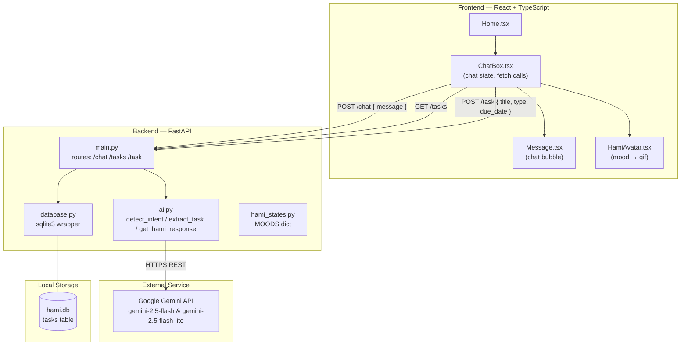
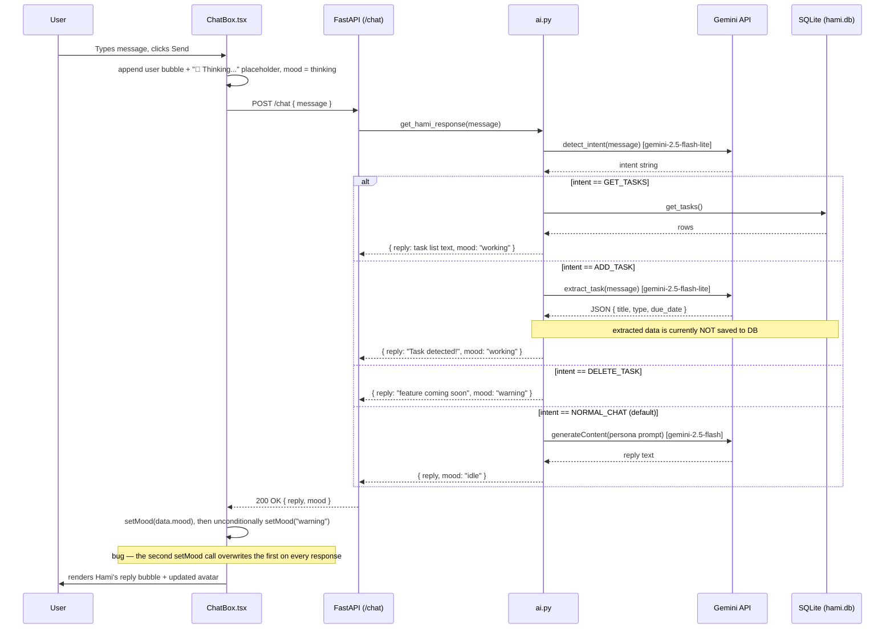
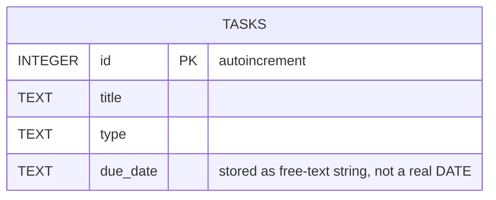

# 🐹 Hami AI

Hami is a cute hamster-themed AI assistant with a chat interface, mood-driven avatar, and a lightweight task/deadline tracker. A FastAPI backend classifies user intent and talks to Google's Gemini models; a React + TypeScript frontend renders the chat and an animated Hami that reacts to what's happening.

> **Status:** Early prototype / work in progress. See [Known Issues & Gaps](#known-issues--gaps) before relying on this for anything real.

---

## Table of Contents

- [Features](#features)
- [Tech Stack](#tech-stack)
- [Project Structure](#project-structure)
- [Architecture](#architecture)
- [How a Chat Request Flows](#how-a-chat-request-flows)
- [Mood System](#mood-system)
- [Data Model](#data-model)
- [Getting Started](#getting-started)
- [API Reference](#api-reference)
- [Known Issues & Gaps](#known-issues--gaps)
- [Suggested Roadmap](#suggested-roadmap)

---

## Features

- 💬 **Chat with Hami** — a friendly hamster persona powered by Gemini (`gemini-2.5-flash`).
- 🧠 **Intent detection** — every message is classified into `ADD_TASK`, `GET_TASKS`, `DELETE_TASK`, or `NORMAL_CHAT` using a separate Gemini call (`gemini-2.5-flash-lite`).
- ✅ **Task extraction** — when the intent is `ADD_TASK`, Gemini is asked to pull a structured `{title, type, due_date}` object out of free text.
- 🎭 **Mood-reactive avatar** — Hami's GIF changes (`idle`, `thinking`, `working`, `happy`, `warning`, `sleeping`) based on backend state.
- 🗄️ **SQLite-backed task list** — tasks are stored locally in `hami.db`.
- 🌐 **Simple REST API** — `/chat`, `/tasks`, `/task` endpoints served by FastAPI.

---

## Tech Stack

| Layer | Technology |
|---|---|
| Frontend | React + TypeScript (Vite-style project layout), inline styles |
| Backend | Python, FastAPI, Pydantic |
| AI | Google Gemini API (`gemini-2.5-flash`, `gemini-2.5-flash-lite`) via raw `requests` calls |
| Database | SQLite (`hami.db`), accessed with the stdlib `sqlite3` module |
| Config | `python-dotenv` (`.env` file for `GEMINI_API_KEY`) |

---

## Project Structure

```
.
├── backend/
│   ├── main.py           # FastAPI app & routes (/chat, /tasks, /task)
│   ├── ai.py              # Gemini calls: intent detection, task extraction, chat reply
│   ├── database.py        # SQLite connection + add_task / get_tasks / delete_task
│   ├── hami_states.py     # MOODS constant dictionary
│   ├── test.py            # Ad-hoc manual script for exercising database.py
│   └── .env                # GEMINI_API_KEY (not committed)
│
└── frontend/
    ├── public/
    │   ├── favicon.svg
    │   └── icons.svg       # social/brand icon sprite (bluesky, discord, github, x, docs, social)
    └── src/
        ├── pages/
        │   └── Home.tsx            # Page shell, renders <ChatBox />
        ├── components/
        │   ├── ChatBox.tsx         # Chat state, network calls, message list, input
        │   ├── Message.tsx         # Single chat bubble (user vs hami styling)
        │   └── HamiAvatar.tsx      # Maps mood -> GIF asset
        ├── assets/hami/
        │   ├── idle.gif
        │   ├── thinking.gif
        │   ├── working.gif
        │   ├── happy.gif
        │   └── warning.gif        # NOTE: no sleeping.gif (see Known Issues)
        └── types/
            └── Message.ts          # `Message { sender: "user" | "hami"; text: string }`
```

---

## Architecture



**Notes on the current wiring:**
- The frontend calls a **hardcoded** `http://127.0.0.1:8000` base URL (no env-based config).
- `main.py` imports `add_task` and `delete_task` from `database.py`, but only `/task` (POST) actually calls `add_task`. Nothing currently calls `delete_task`.
- `ai.py` also imports `add_task`/`get_tasks` from `database.py` but only uses them indirectly via `get_hami_response`'s `GET_TASKS` branch — the `ADD_TASK` branch extracts data but never persists it (see [Known Issues](#known-issues--gaps)).

---

## How a Chat Request Flows



---

## Mood System

`backend/hami_states.py` defines six moods, but not all of them are reachable from the current code paths.

| Mood | Defined in `hami_states.py` | Has a GIF in `HamiAvatar.tsx` | Ever returned by `ai.py` |
|---|:---:|:---:|:---:|
| `idle` | ✅ | ✅ | ✅ (default / `NORMAL_CHAT`) |
| `thinking` | ✅ | ✅ | ⚠️ only set client-side while waiting, never returned by the backend |
| `working` | ✅ | ✅ | ✅ (`ADD_TASK`, `GET_TASKS`) |
| `warning` | ✅ | ✅ | ✅ (`DELETE_TASK`, and error fallback) — but see the ChatBox bug above, which forces `warning` on *every* response |
| `happy` | ✅ | ✅ | ❌ never returned anywhere in `ai.py` |
| `sleeping` | ✅ | ❌ no gif imported, falls back to `idle` in the `switch` | ❌ never returned anywhere |

```mermaid
stateDiagram-v2
    [*] --> idle
    idle --> thinking: user sends a message (client-side only)
    thinking --> working: intent = ADD_TASK / GET_TASKS
    thinking --> warning: intent = DELETE_TASK or request error
    thinking --> idle: intent = NORMAL_CHAT
    working --> idle
    warning --> idle
    idle --> happy: not currently triggered by any backend logic
    idle --> sleeping: not currently triggered anywhere; no GIF asset exists
```



---

## Data Model

A single `tasks` table lives in `hami.db`:



`get_tasks()` returns raw SQLite tuples `(id, title, type, due_date)` — there's no ORM/model layer, and the API currently returns these tuples as JSON arrays-of-arrays rather than named objects.

---

## Getting Started

### Prerequisites
- Python 3.10+
- Node.js 18+ and a package manager (npm/pnpm/yarn)
- A Google Gemini API key ([Google AI Studio](https://aistudio.google.com/))

### Backend

```bash
cd backend
python -m venv venv
source venv/bin/activate        # Windows: venv\Scripts\activate
pip install fastapi uvicorn requests python-dotenv pydantic

# Create backend/.env with:
echo "GEMINI_API_KEY=your_key_here" > .env

uvicorn main:app --reload --port 8000
```

The API will be available at `http://127.0.0.1:8000`.

### Frontend

```bash
cd frontend
npm install
npm run dev
```

The frontend expects the backend at `http://127.0.0.1:8000` — this is hardcoded in `ChatBox.tsx`, so both must run on those exact host/port values (or you'll need to edit the fetch URL).

---

## API Reference

See [`docs/API.md`](docs/API.md) for full request/response details, or the quick summary below.

| Method | Path | Body | Returns |
|---|---|---|---|
| `POST` | `/chat` | `{ "message": string }` | `{ "reply": string, "mood": string }` |
| `GET` | `/tasks` | — | array of task rows |
| `POST` | `/task` | `{ "title": string, "type": string, "due_date": string }` | `{ "success": true }` |
